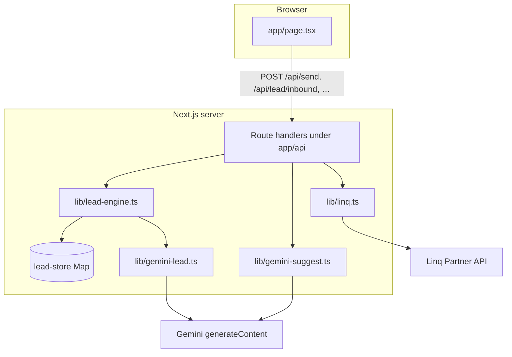

# Architecture

This app is a **single-page agent dashboard** that talks to **Linq Partner API v3** for real SMS/iMessage/RCS and to **Google Gemini** for lead qualification and reply suggestions. Secrets stay on the server.

## High-level diagram

## Two different “AI reply” features

| Feature | Trigger | API | Purpose |
|--------|---------|-----|---------|
| **Lead qualification** | After each **customer** line (real, simulated, or “Test as customer”) | `POST /api/lead/inbound` | Updates `LeadState` (stage, answers, category) and returns **three** labeled SMS drafts for the agent. Human always sends via Linq. |
| **Transcript suggestions** | “Refresh” / sync flow using thread text | `POST /api/suggest` or bundled in `POST /api/conversation/analyze` | Optional **three** reply chips from the **whole** transcript; separate prompts from the lead flow. |

Do not confuse them: lead drafts are tied to the qualification state machine; transcript chips are a generic “what could the agent say next?” helper.

## Lead qualification state machine

Stored per **conversation key** in `lib/lead-store.ts` (in-memory `Map`; lost on server restart).

Stages (`LeadStage` in `lib/lead-types.ts`):

1. **intro** — First customer message: extract intent summary + urgency → advance to `question1`.
2. **question1** — Capture what they need (`lookingFor`) → `question2`.
3. **question2** — Capture budget, timeline, category, escalate → **done**.
4. **done** — Further messages use follow-up / error-recovery reply styles only.

`lib/lead-engine.ts` implements `processLeadInbound`: for each stage it may call Gemini extractors (`extractIntro`, `extractAfterQ1`, `extractFinal`) and then `generateLeadAgentReplySuggestions` with structured context. On API failure, heuristics fill gaps so the UI still gets suggestions.

**Conversation key:** The browser generates a stable id in `localStorage` (`linq_lead_session`, prefix `sess_…`) and sends it as `conversationKey`. That key is **intentionally not** replaced by Linq `chatId` after the first send, so qualification does not reset when a chat is created.

For **webhooks**, Linq passes `chat_id`; the server uses that as the key so phone-originated messages align with the same stored state as long as you use one chat per pair.

## Syncing from Linq (`POST /api/conversation/analyze`)

Used by **Load thread from Linq** in the UI:

1. Resolve `chatId` from env `from`/`to` (or explicit ids in the JSON body).
2. Paginate `GET /v3/chats/{id}/messages`, map to inbound/outbound lines.
3. Build transcript (`transcriptFromLinqMessages`).
4. **Lead state:** Prefer `synthesizeLeadStateFromTranscript` (one Gemini call on full transcript). If that fails, **replay** `replayLeadQualificationFromThread` (re-run the state machine per inbound line). Persist with `conversationKey` when provided.
5. Optionally call `generateReplySuggestions` for transcript chips unless `skipGemini` is set.

## Webhook (`POST /api/webhook`)

Handles Linq events (e.g. `message.received`). Extracts text, runs `processLeadInbound(chatId, text, …)` so lead state matches inbound SMS. **Does not** send outbound SMS; the agent still uses the dashboard and `POST /api/send`.

## Security and deployment notes

- **Token:** `LINQ_API_TOKEN` and `GEMINI_API_KEY` are read only in server code (`process.env`).
- **Horizontal scaling:** `lead-store` is process-local. Multiple instances do not share qualification state unless you add Redis/DB. `lib/inbox-sse-bus.ts` is an in-memory SSE fan-out stub; nothing in the current UI subscribes yet—if you add live push, use Redis pub/sub across nodes.

## Key file map

| Path | Role |
|------|------|
| `app/page.tsx` | Client UI: messages, send, simulate, test customer, sync, purge, lead panel |
| `lib/linq.ts` | Linq REST: chats, messages, send, purge |
| `lib/linq-env.ts` | Resolve sender/receiver E.164 from env |
| `lib/phone.ts` | `normalizeE164` |
| `lib/lead-types.ts` | `LeadState`, `LeadStage`, etc. |
| `lib/lead-store.ts` | In-memory get/set/reset by key |
| `lib/lead-engine.ts` | `processLeadInbound`, replay helper |
| `lib/gemini-lead.ts` | Structured extraction, reply drafts, transcript synthesis |
| `lib/gemini-suggest.ts` | Transcript-only reply chips |
| `lib/inbox-sse-bus.ts` | Optional SSE broadcast (not wired to routes in this repo) |
